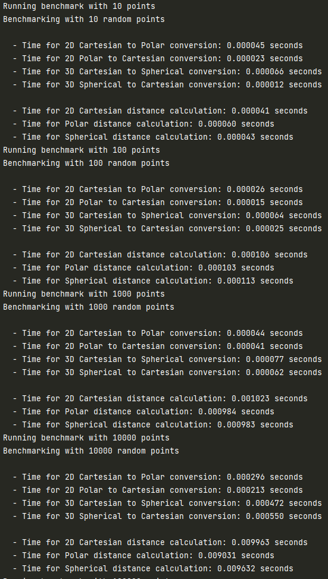
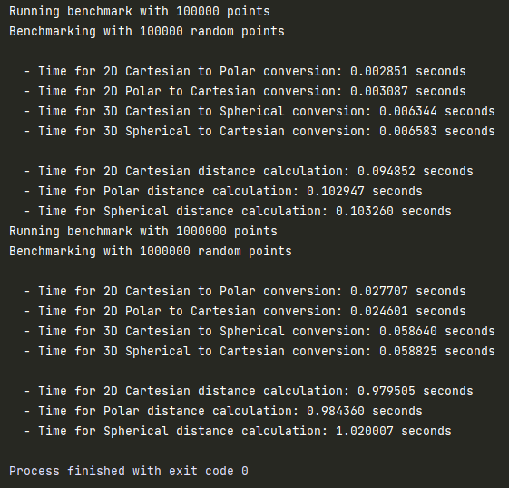

# **Workshop № 1**
## *Comparison of Computational Complexity in Calculating Distances Between Points Across Different Coordinate Systems* 

Practical Task:
- [ ] Generate an array of point pairs in a two-dimensional Cartesian coordinate
system.
- [ ] Convert the coordinates of the points from the Cartesian system to the
polar system.
- [ ] Convert the coordinates of the points back from the polar system to the
Cartesian system, ensuring the values match the original ones.
- [ ] Generate an array of point pairs in a three-dimensional Cartesian
coordinate system.
- [ ] Convert the coordinates of the points from the Cartesian system to the
spherical system.
- [ ] Convert the coordinates of the points back from the spherical system to
the Cartesian system, ensuring the values match the original ones.
- [ ] Implement functions to calculate the distance between two points in the
Cartesian, polar, and spherical coordinate systems.
- [ ] Perform distance calculations between all pairs of points in each of the
coordinate systems.
- [ ] Compare the computational complexity of calculations for different
coordinate systems.

## Computation Time Analysis:

Conversions:
- 2D Cartesian to Polar and vice versa typically took less time compared to 3D conversions.
- 3D Cartesian to Spherical and vice versa had slightly longer computation times due to additional dimension processing.

Distance Calculations:
- 2D Cartesian distances were generally faster, indicating lower computational complexity due to fewer operations involved.
- Polar distances took longer compared to Cartesian, likely due to angle-based operations.
- Spherical distances were slower, reflecting the increased complexity of 3D calculations involving both theta and phi angles.

Efficiency of Distance Calculations
- Cartesian Coordinate System proved to be more efficient for distance calculations. It avoids trigonometric computations, using simpler arithmetic operations instead.
- Polar and Spherical Systems incur overhead from angle-based computations, resulting in longer distance calculation times.

## Results:

