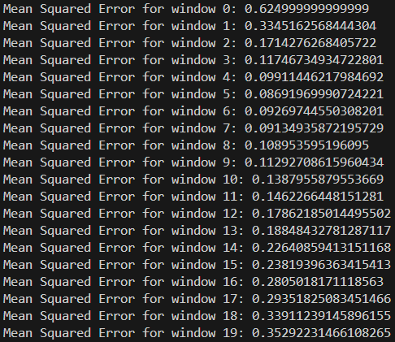

# **Workshop № 2**
## * Analysis and Processing of Digital Signals* 

Practical Task:
Assess the optimality of the moving average window size.

## Results Analysis:
The Mean Squared Error (MSE) provides an indication of the error or deviation between a filtered signal and the actual signal. When analyzing a Moving Average (MA) filter with various window sizes, it's crucial to find a balance between smoothing (reducing noise) and maintaining signal fidelity.

Our data shows that:
- The MSE decreases initially as the window size increases, reaching a minimum point, and then starts to increase again. This is consistent with the behavior of MA filters—small window sizes may not effectively reduce noise, leading to higher MSE, while larger window sizes might excessively smooth out the signal, removing important variations.
- The lowest MSE in this data set is achieved with a window size of 5 (0.08415473879595722). This suggests that a window size of 5 offers the best compromise between smoothing noise and maintaining signal fidelity.
- As the window size increases beyond 5, the MSE starts to climb again. This increase might be due to the smoothing effect removing relevant signal variations, causing the filtered output to deviate from the true signal.

## Conclusion:

Based on this analysis, the optimal window size for a Moving Average filter appears to be 5. This size achieves the best trade-off between reducing noise and preserving the underlying signal characteristics.

## Results:
