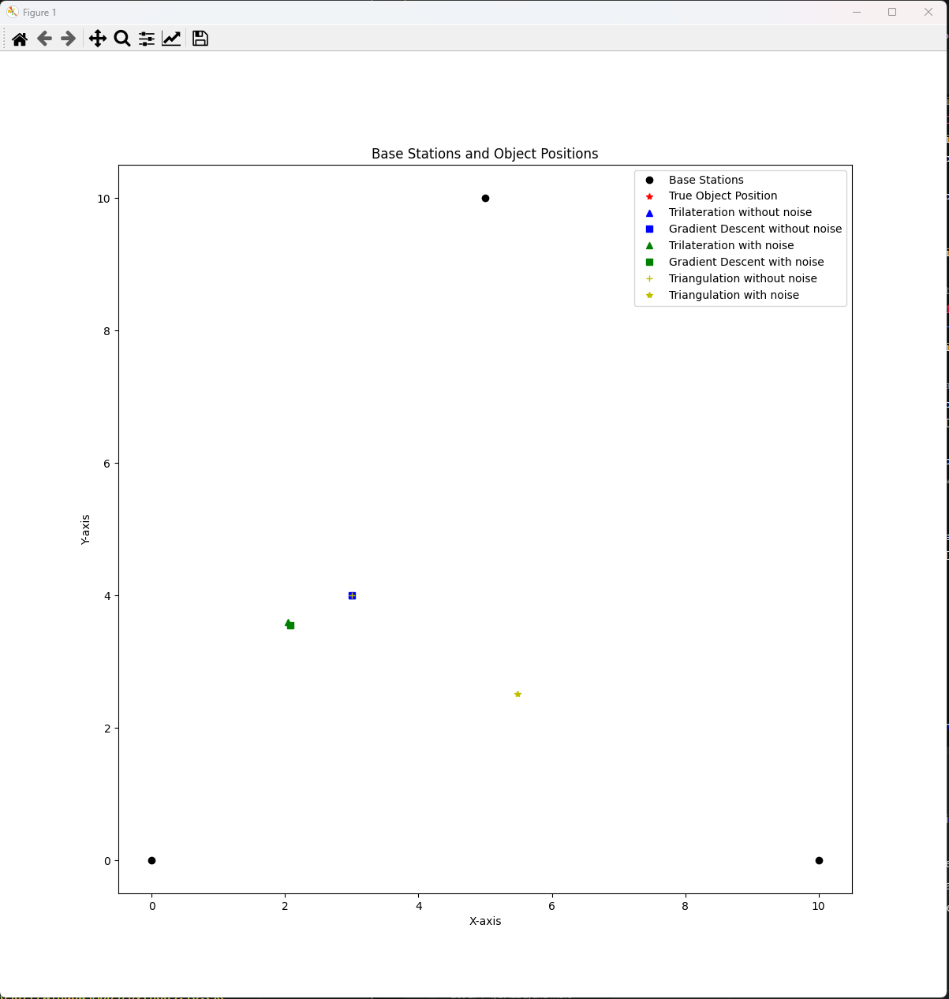
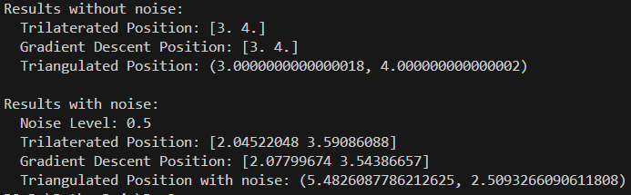

# **Workshop № 3**
## *Studying methods for determining the coordinates of an object* 

Practical Task:
Determine the coordinates of an object in two-dimensional space using trilateration triangulation, and gradient descent methods.

## Results Analysis:

- Trilateration tends to cluster around the true object position but can vary, depending on the noise level and distance errors. The results may indicate some bias due to the layout of the base stations and error propagation through the trilateration process.

- Triangulation may yield varying results depending on the accuracy of angle estimation. Due to noise, intersecting lines might not align precisely, leading to potential inaccuracies.

- Gradient Descent generally aligns with the true position, showcasing how this method iteratively refines an initial guess to find the minimum error. However, the initialization point can impact the final result.

## Conclusion:

Overall, each method has strengths and weaknesses. Trilateration and triangulation depend on distance and angle accuracy, respectively, while Gradient Descent relies on convergence to an optimal solution. To improve accuracy, combining multiple methods, reducing noise, and using additional base stations might be effective.

## Results:

