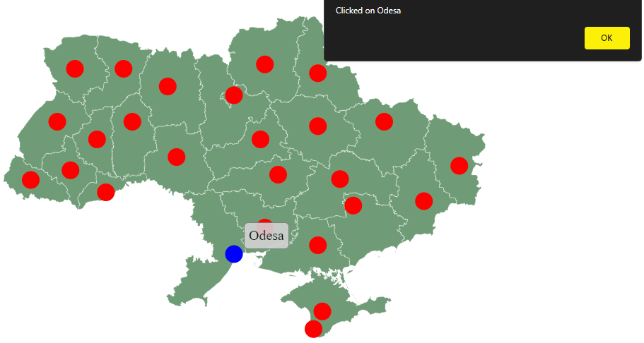

# **Workshop № 4**
## *Creating a map of the country using SVG* 

Practical Task:

## Results Analysis:
- Draw the outline of the chosen country's map using SVG paths.
- Place markers on the map for all regional centers of the country.
- Add text labels to each marker to indicate the name of the regional center
- Implement an interactive tooltip feature that displays additional
information about the city when the mouse hovers over its marker.

## Conclusion:

SVG, or Scalable Vector Graphics, is a versatile format for creating and displaying vector-based images. It is ideal for scalable, high-quality graphics that can be manipulated, animated, and styled using CSS and JavaScript. SVG offers a flexible approach to creating interactive elements for web applications, allowing you to design everything from simple shapes to complex illustrations, logos, charts, and maps. It supports interactivity and can integrate seamlessly with other web technologies. Overall, SVG is a powerful tool for web designers and developers seeking to create responsive, adaptable, and visually engaging graphics.

## Results:

